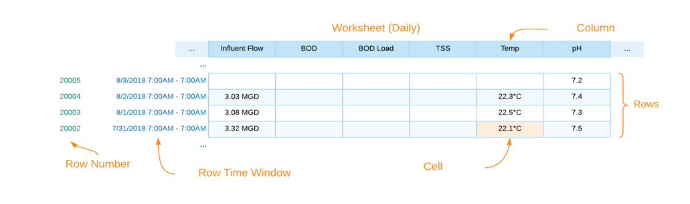
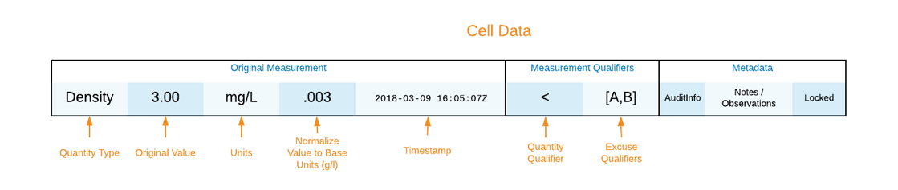

Spreadsheets
====

Water treatment, purpose built data models of tabular data related to water treatment operations. 
Used in conjunction with Enterprise Twins to model the treatment process and Common Computations to calculate data needed to 
operate treatment processes and facilities within regulatory compliance.

Worksheet
-------

Worksheet Type
^^^^^^^

   - Time-window based view (Hourly, Daily, etc.)
   - For Windows such as Daily a definition of day is required
   - Based on a Time Zone
   - This is the defined list of all of the columns, not the visual display (Worksheet View)

Row
^^^^^^^

The data recorded for a time window

Row Number
^^^^^^^

Each row will have an incremental number that can be referenced This row number is the number of rows starting from January 1, 1900.

Worksheet Row Time Window
^^^^^^^

Within a worksheet a span of time with a beginning and end time.

Worksheet Column (Parameter)
^^^^^^^

Represents the specific occurrence of the parameter gathered within a worksheet.

Cell
^^^^^^^

Value recorded for a Worksheet Column within the worksheet row

Cell Data
^^^^^^^

Versions of the data entered into the Cell

Sheet
^^^^^^^

A rendering of a Worksheet with a reduced set of columns (parameters)

.. autosummary::
   :toctree: generated
  
